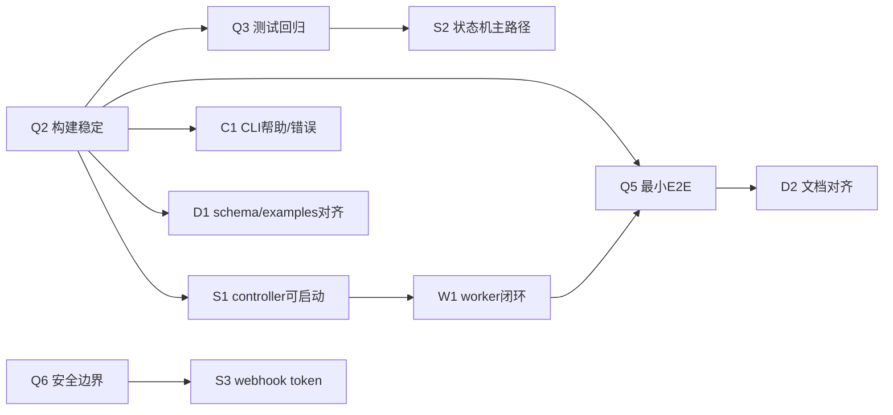

# clawkit 发布收口计划（MVP v0.1.0）

本文档用于指导 clawkit 在 **“最终验收与发布收口阶段”** 完成收敛与发布。
它强调“只做阻塞发布的最小改动”，并提供可并行推进的波次、依赖关系、验收清单与风险兜底。

> 适用范围：首个可发布 MVP（建议版本 `v0.1.0`）

## 0. 目标 / 非目标 / 发布范围

### 0.1 目标（必须达成）

1. **可构建、可测试、可演示**：`pnpm build`、`pnpm test`、最小 E2E（单机模式）可复现通过。
2. **文档与实现一致**：README、核心 docs、examples 与 CLI 行为一致，可指导用户跑通最小主链路。
3. **边界明确且可解释**：对“暂不做”的功能、已知限制、运行前置条件给出清晰说明。
4. **发布产物可消费**：至少能以“源码 + 构建产物（dist）+ 示例配置 + 文档”的形式交付；若对外发布，需满足 npm 发布前置。

### 0.2 非目标（本次收口明确不做）

- 复杂 Web 管理后台能力（当前 Web Console 仅覆盖最小可用页面与任务确认场景）
- 自动 PR / 自动托管平台集成
- 复杂远程编排、复杂调度系统、复杂权限系统
- controller 侧真实模型推理

### 0.3 发布范围（收口覆盖面）

- Monorepo：`packages/cli` / `packages/controller` / `packages/worker` / `packages/shared` / `packages/templates`
- 示例：`examples/*.yaml`
- 关键文档：`README.md` 与 `docs/` 下的核心文档
- 脚本：`scripts/` 中的最小 E2E 与本地演示脚本

## 1. 收口原则（何时改、改到什么程度）

### 1.1 缺陷分级

- **P0（阻塞发布）**：无法 build/test；最小 E2E 无法跑通；命令/参数与文档严重不一致导致用户无法按文档使用；存在明显安全边界问题（如泄露 token）。
- **P1（强烈建议）**：关键错误信息不清晰、导致排查困难；主要路径存在较大易踩坑但可规避；examples 与 schema 轻微偏差。
- **P2（可延后）**：体验优化、重构、边缘场景补齐、更多样例。

### 1.2 变更约束

- 只接受 **P0/P1** 改动进入发布分支；P2 进入后续版本。
- 单个改动必须有：影响面说明、验证方式、回滚路径。
- 避免“顺手重构/格式化全仓库”导致 diff 失控。

## 2. 任务拆解（WBS）

说明：任务以“可验收”为单位拆分；每项包含依赖与验收。并行推进时以波次为边界。

### 2.1 工程与质量（横切）

| 任务ID | 任务 | 依赖 | 验收标准 |
|---|---|---|---|
| Q1 | 统一版本号与发布信息（root + 各 package） | 无 | `package.json` 版本一致；`CHANGELOG.md` 对应版本条目完整 |
| Q2 | 构建链路稳定性检查 | 无 | `pnpm build` 退出码 0；可在干净环境复现 |
| Q3 | 测试与回归基线 | Q2 | `pnpm test` 退出码 0；失败用例可定位、非随机 |
| Q4 | TypeScript 严格性与导出稳定性 | Q2 | `tsc` 无 error；对外导出（`dist/index.d.ts`）无明显缺口 |
| Q5 | 最小运行脚本可复现（单机） | Q2 | `node ./scripts/e2e-local-demo.js` 能跑通最小链路或给出可操作错误 |
| Q6 | 安全边界自查（token、日志脱敏） | 无 | 文档与代码均不输出敏感信息；token 校验失败返回清晰中文错误 |

### 2.2 CLI（packages/cli）

| 任务ID | 任务 | 依赖 | 验收标准 |
|---|---|---|---|
| C1 | CLI 帮助与错误信息一致性 | Q2 | `clawkit --help`、各命令 `--help` 输出合理；错误信息中文且可操作 |
| C2 | `init` 生成的配置可被后续命令读取 | Q2 | `init` 产物可被 `doctor/plan/apply/heal` 正确读取 |
| C3 | `doctor` 诊断覆盖“最小主链路前置” | Q2 | 对 Node/pnpm/文件路径/端口等关键项给出明确结论 |
| C4 | `plan/apply/heal` 的 dry-run 与真实行为边界说明 | Q2 | `--dry-run` 不产生破坏性写入；输出中包含“将写入哪些文件/位置” |

### 2.3 Controller（packages/controller）

| 任务ID | 任务 | 依赖 | 验收标准 |
|---|---|---|---|
| S1 | HTTP API 可启动与健康检查 | Q2 | `pnpm --filter @clawkit/controller build && pnpm --filter @clawkit/controller start` 可启动；健康接口可用 |
| S2 | 协议解析与状态机主路径回归 | Q3 | `approved -> dispatched -> running -> done/failed` 主路径可复现 |
| S3 | OpenClaw webhook token 校验与错误码 | Q6 | 401/403/503 等返回符合文档说明；日志不泄露 token |
| S4 | 持久化初始化与兼容 | Q2 | SQLite 初始化脚本随构建产物输出；冷启动不报错 |

### 2.4 Worker（packages/worker）

| 任务ID | 任务 | 依赖 | 验收标准 |
|---|---|---|---|
| W1 | register/heartbeat/pull/result 基本闭环 | Q3,S1 | 与 controller 联调通过；失败场景给出中文可操作提示 |
| W2 | OpenCodeExecutor 双路径（SDK/CLI）说明与回退策略 | Q5 | 文档说明真实执行前置；placeholder fallback 仅用于链路验证且可配置关闭 |

### 2.5 Shared / Templates / Examples / Docs

| 任务ID | 任务 | 依赖 | 验收标准 |
|---|---|---|---|
| D1 | manifest schema 与 examples 对齐 | Q4 | `doctor` 对 examples 校验通过；字段含义与注释不冲突 |
| D2 | 核心 docs 与实现对齐（CLI/doctor/e2e/安全边界） | Q2,Q5,Q6 | README 与 docs 能指导用户跑通最小链路；关键参数与默认值准确 |
| D3 | 发布说明与已知限制整理 | 无 | `CHANGELOG.md` + README 的“已知限制”明确、可复现 |

## 3. 并行波次（Parallel Waves）

### Wave 0：冻结与盘点（建议 0.5 天）

- 输出：收口清单（P0/P1/P2）、发布范围确认、冻结规则。
- 关键动作：
  - 设定 code freeze 时间点（仅允许 P0/P1 合入）
  - 明确发布产物形态（内部交付 vs npm 发布）

#### 冻结规则（建议直接复用）

- Freeze 后只允许合入 **P0/P1**；所有 P2 进入后续版本（`docs/roadmap.md` 维护）。
- 每个合入必须附带：
  - 影响面（影响哪个包/哪种拓扑）
  - 验证证据（命令 + 关键输出，需脱敏）
  - 回滚方式（最少说明“如何撤销/如何降级”）
- 避免大范围格式化与非必要重构；收口阶段以“可验证”为第一目标。

### Wave 1：工程基线（建议 1 天，可并行）

并行组：

- A 组（工程）：Q1/Q2/Q4
- B 组（测试回归）：Q3/Q5
- C 组（安全边界）：Q6

波次退出条件：`pnpm build` / `pnpm test` / 最小 E2E 均可复现（或失败原因可操作且已被归类为 P0/P1）。

### Wave 2：面向用户的可用性（建议 1 天，可并行）

并行组：

- CLI 组：C1/C2/C3/C4
- Docs & Examples 组：D1/D2/D3

依赖：Wave 1 输出稳定基线（否则文档会反复漂移）。

### Wave 3：发布演练与发布结论（建议 0.5~1 天）

并行组：

- 发布演练：打 tag、生成 release notes、验证安装/运行路径
- 最终验收：按“验收清单”逐条勾选，形成发布结论

## 4. 依赖关系（关键路径）

### 4.1 关键路径（必须串行保证）

1. **Q2 构建稳定** → 2. **Q3 测试稳定** → 3. **Q5 最小 E2E** → 4. **D2 文档对齐** → 5. **发布演练**

### 4.2 依赖图（Mermaid，可选）



## 5. 验收清单（Release Acceptance Checklist）

> 这里的清单是“发布前必须逐条勾选”的核对项；建议在 PR/发布说明中粘贴该清单作为证据。

### 5.1 必须项（Fail fast）

- [ ] Node.js 版本满足 `>=20`（`node -v`）
- [ ] pnpm 版本满足 `>=8`（`pnpm -v`）
- [ ] `pnpm install` 在干净环境可完成（无交互依赖）
- [ ] `pnpm build` 通过
- [ ] `pnpm test` 通过
- [ ] `node ./scripts/e2e-local-demo.js` 可跑通最小链路（或明确说明其“仅链路验证”的前置）
- [ ] `examples/all-in-one.yaml`、`examples/hybrid.yaml`、`examples/split.yaml` 能被 `doctor` 正确读取并通过 schema 校验
- [ ] README 的“最小运行步骤”可按文档复现
- [ ] 已知限制与边界（placeholder fallback、真实 OpenCode 前置）写清楚且与代码一致

### 5.2 建议项（不阻塞，但强烈建议）

- [ ] controller/worker 的失败场景（OpenCode 不可达、webhook token 错误）返回中文可操作错误
- [ ] 日志不输出敏感信息（token、密钥、cookie）
- [ ] `CHANGELOG.md` 完整、与版本号一致
- [ ] 若计划公开开源：补充 `LICENSE` 并在 README 中声明

### 5.3 发布产物核对（交付形态）

至少满足其一：

1. **内部交付**：提供源码仓库 + `pnpm build` 可生成 dist + 完整 docs/examples
2. **npm 发布（可选）**：
   - `@clawkit/cli` 可 `npm publish`（或内部 registry）
   - 安装后 `clawkit --help` 可用
   - 发布时锁定 `files`/`main`/`types`/`bin` 正确（避免漏发布 dist）

## 6. 风险点（含缓解与兜底）

### 高风险（必须在发布前关闭或可控）

1. **环境差异导致 E2E 不可复现**
   - 缓解：将 E2E 依赖的前置（端口、OpenCode server、fallback 开关）写入 `docs/e2e.md` 并在脚本输出提示。
   - 兜底：提供“链路验证模式（placeholder fallback）”与“严格真实执行模式”两套验收口径，明确二者差异。

2. **发布产物不完整（漏 dist/SQL/init 文件）**
   - 缓解：发布演练必须从“空目录安装/构建/启动”验证；controller build 已拷贝 `init.sql`，需在演练中验证。
   - 兜底：内部交付时明确“需源码构建”，不承诺预编译包。

3. **安全边界/日志脱敏不足**
   - 缓解：在 webhook/token 校验、配置加载失败处做脱敏；文档标注不要把 token 写进日志或示例。
   - 兜底：默认不开启任何会外泄敏感信息的 debug 输出；出问题用可定位的错误码与字段名替代原文。

### 中风险（可通过流程控制）

1. **文档漂移**（实现快速变动导致 README/docs 不一致）
   - 缓解：Wave 1 先稳定工程基线；Wave 2 再集中对齐文档。

2. **范围蔓延**（收口阶段做了过多“顺便优化”）
   - 缓解：冻结规则 + P0/P1/P2 分级；所有 P2 直接放入 `docs/roadmap.md` 的 v0.1.x。

### 低风险（可接受）

- Web Console 已纳入当前内部 MVP，但使用者可能误判为“完整管理后台”。
  - 缓解：README 与发布文档明确其定位是轻量可视化外壳，不等于复杂平台能力。

## 7. 发布演练（建议流程）

> 该流程用于发布前“走一遍”，确保发布结论有证据。

1. 干净环境（或新目录）拉取代码
2. `pnpm install`
3. `pnpm build`
4. `pnpm test`
5. 运行最小演示：`node ./scripts/e2e-local-demo.js`
6. CLI 快速回归：
   - `node ./packages/cli/dist/index.js --help`
   - `node ./packages/cli/dist/index.js doctor -f ./examples/all-in-one.yaml`
7. 形成发布结论：记录命令输出、截图或日志片段（注意脱敏）

## 7.1 回滚与降级策略（发布兜底）

> 收口阶段不追求“完美回滚系统”，但必须至少有可操作的降级手段。

- **代码层面**：
  - 保留发布前的 tag（例如 `v0.1.0-rc.1`）用于快速对比与回退。
  - 发生 P0 事故时，优先 revert 引入问题的 commit，并重新走 Wave 1/3 的最小验收。
- **npm 发布层面（若启用）**：
  - 发现严重问题：立即发布 `0.1.1` 修复或对错误版本执行 `npm deprecate`（注明替代版本与原因）。
  - 避免删除已发布版本（会破坏依赖方可复现性）。
- **运行层面**：
  - `apply` 写入的生成文件应可被备份恢复（若涉及覆盖写入，要求先备份再写）。
  - 当严格真实 OpenCode 执行不可用时，可暂时使用“链路验证模式”（placeholder fallback）用于排查链路，但必须在文档中标注其局限。

## 8. 验收记录模板（建议粘贴到发布说明/PR）

```text
发布版本：v0.1.0
验收时间：YYYY-MM-DD
验收人：

环境：
- node -v = 
- pnpm -v = 

证据：
- pnpm build：通过/失败（附关键日志，已脱敏）
- pnpm test：通过/失败（附关键日志，已脱敏）
- e2e-local-demo：通过/失败（附关键日志，已脱敏）

结论：可发布 / 暂不可发布
阻塞项（若暂不可发布）：
- P0：
- P1：
```

## 9. 与现有文档的关联

- 路线图与发布判断原则：[`docs/roadmap.md`](./roadmap.md)
- 项目范围与边界：[`docs/project-scope.md`](./project-scope.md)
- 最小 E2E：[`docs/e2e.md`](./e2e.md)
- 安全边界：[`docs/security-boundary.md`](./security-boundary.md)
