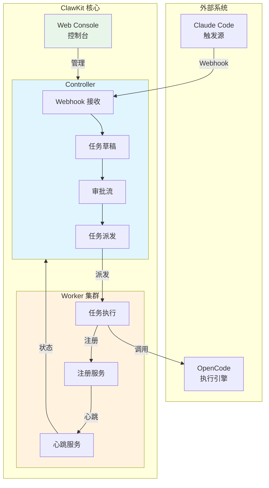
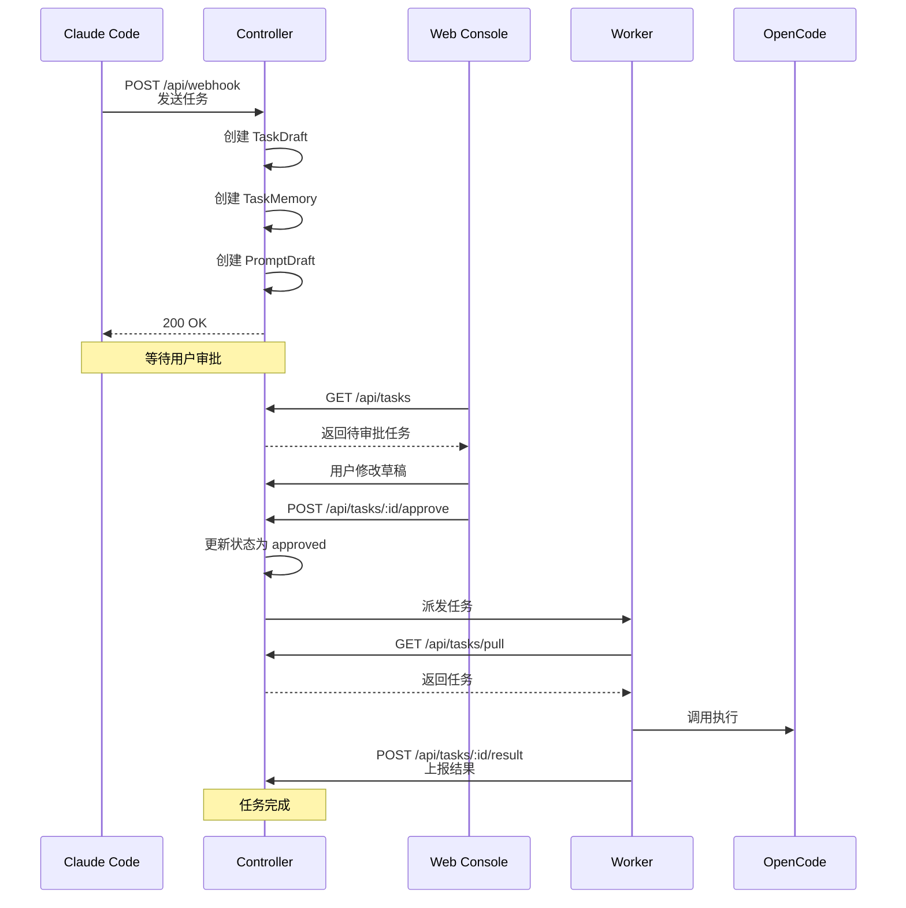
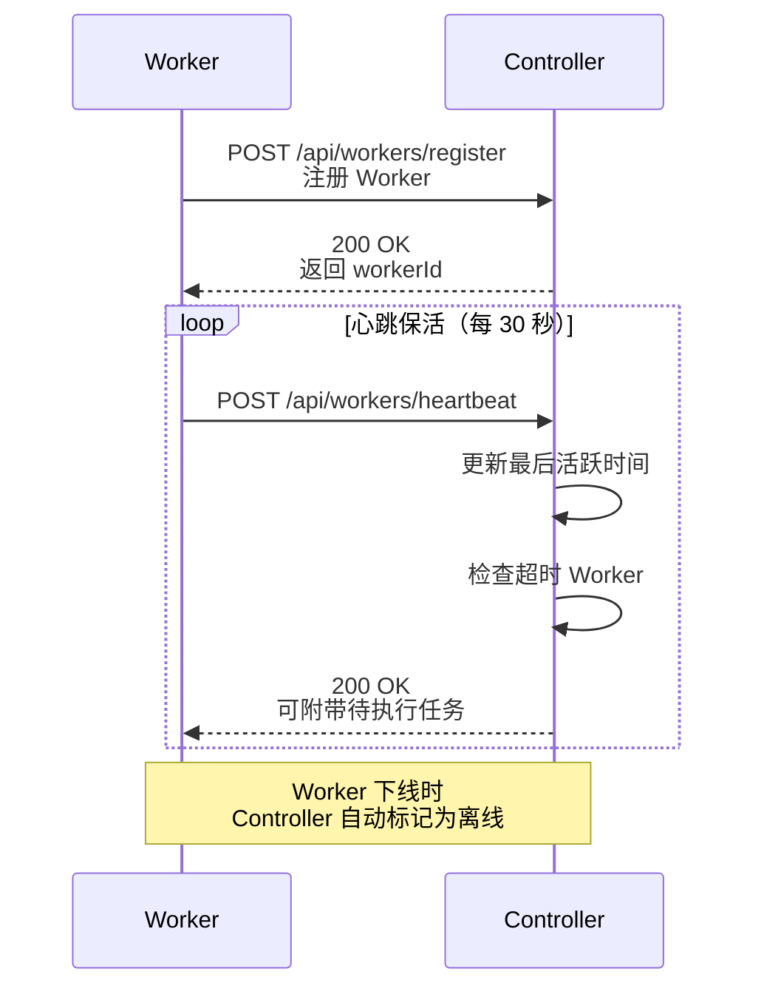
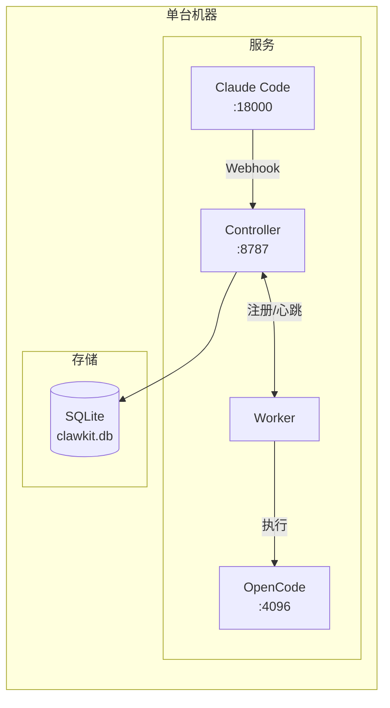
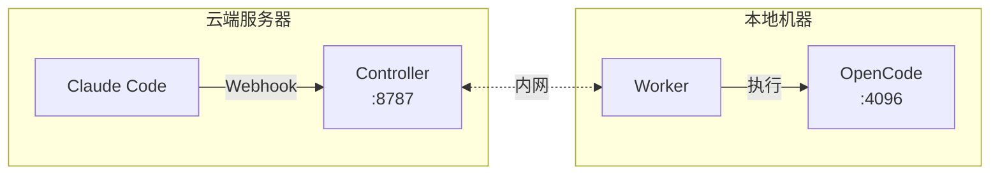
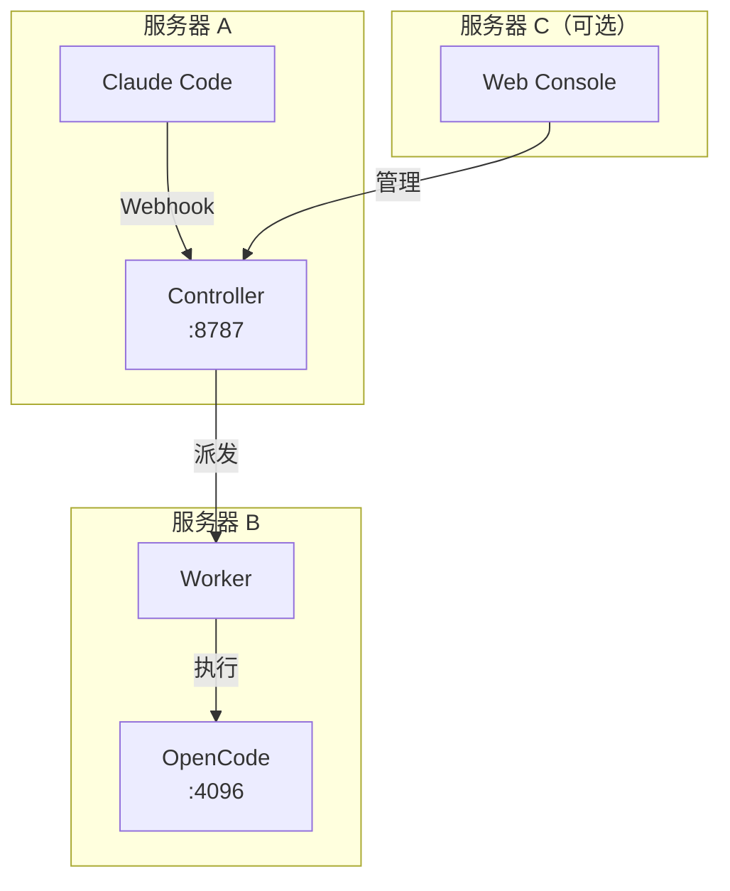
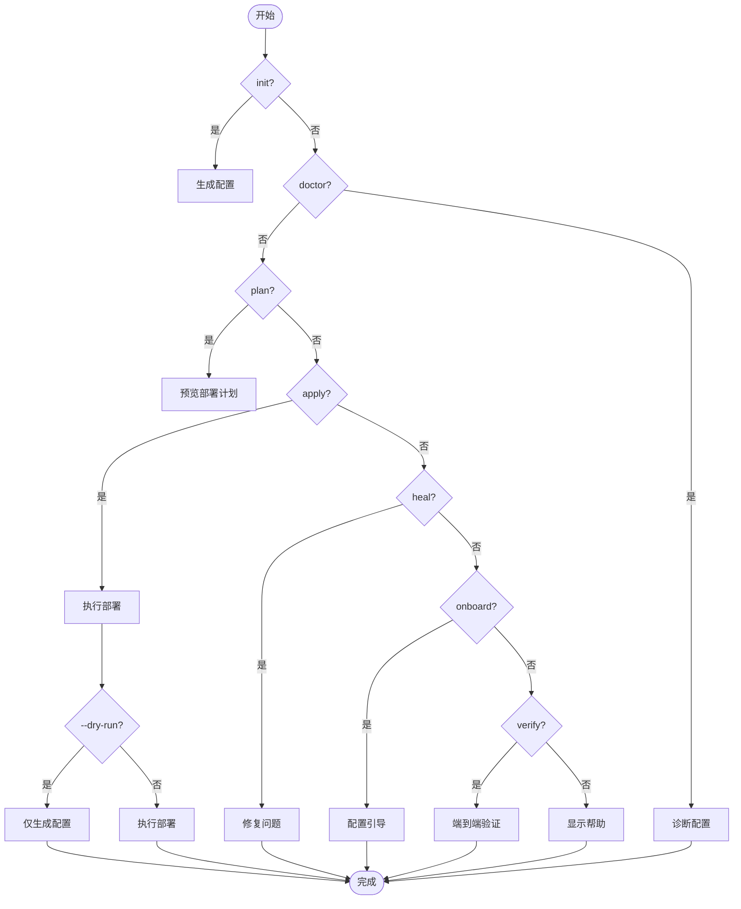
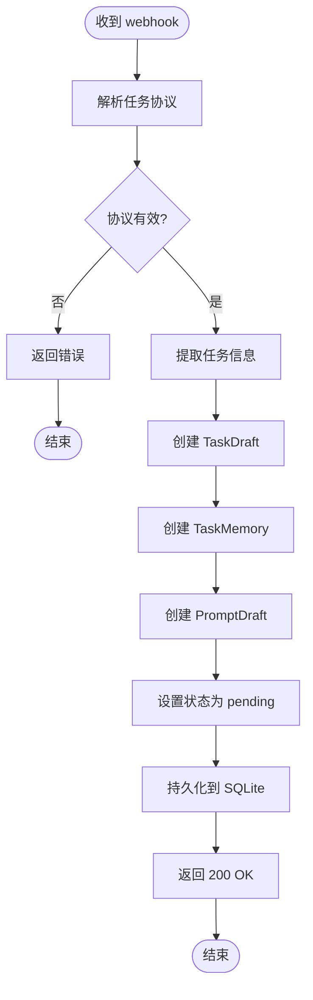
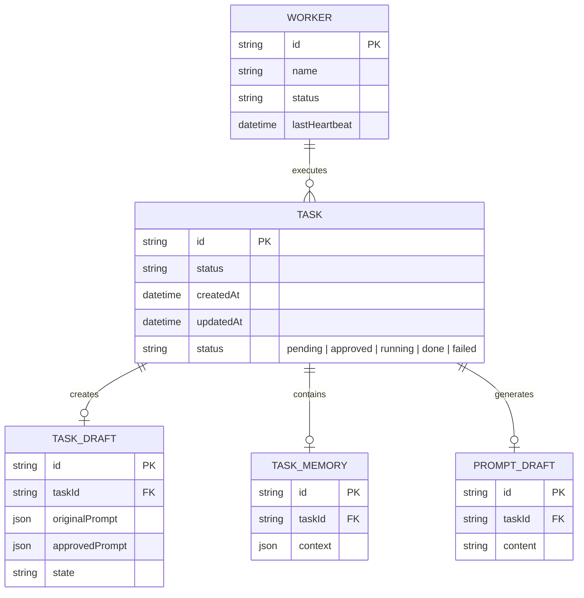
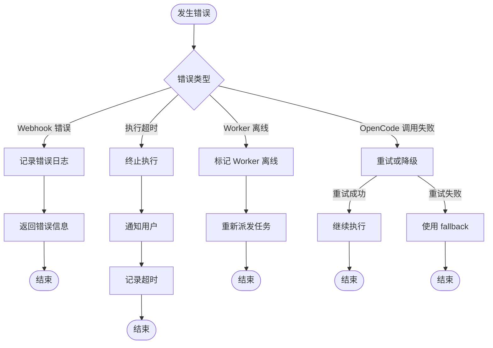

# ClawKit 流程图

本文档使用 Mermaid 语法描述 ClawKit 的核心流程图，可在支持 Mermaid 的工具中渲染（如 GitHub、VS Code、MkDocs 等）。

---

## 1. 系统整体架构



---

## 2. 任务执行完整流程



---

## 3. 任务状态机

```mermaid
stateDiagram-v2
    [*] --> Pending: webhook 接收

    Pending --> Pending: 修改草稿
    Pending --> Approved: 用户确认
    Pending --> Cancelled: 用户取消

    Approved --> Dispatching: 派发给 Worker

    Dispatching --> Running: Worker 拉取任务

    Running --> Success: 执行成功
    Running --> Failed: 执行失败
    Running --> Cancelled: 用户取消

    Success --> [*]
    Failed --> [*]
    Cancelled --> [*]

    note right of Pending
        用户可以：
        - 修改草稿
        - 确认派发
        - 取消任务
        - 查询状态
    end
```

---

## 4. Worker 注册与心跳



---

## 5. 部署拓扑

### 5.1 all-in-one（单机）



### 5.2 hybrid（混合云）



### 5.3 split（多机分离）



---

## 6. CLI 命令流程



---

## 7. Webhook 任务接收流程



---

## 8. Controller API 概览



---

## 9. 错误处理流程



---

## 10. 快速参考图

```
┌─────────────────────────────────────────────────────────────────────┐
│                        ClawKit 快速参考                              │
├─────────────────────────────────────────────────────────────────────┤
│                                                                     │
│  启动命令:                                                          │
│  ┌─────────────────────────────────────────────────────────────┐  │
│  │ pnpm quickstart          # 一键部署                          │  │
│  │ node ./packages/cli/dist/index.js onboard -f <file>          │  │
│  └─────────────────────────────────────────────────────────────┘  │
│                                                                     │
│  访问地址:                                                          │
│  ┌─────────────────────────────────────────────────────────────┐  │
│  │ Web Console:  http://127.0.0.1:8787                        │  │
│  │ Claude Code:   http://127.0.0.1:18000                       │  │
│  │ OpenCode:     http://127.0.0.1:4096                         │  │
│  └─────────────────────────────────────────────────────────────┘  │
│                                                                     │
│  任务状态:                                                          │
│  ┌─────────────────────────────────────────────────────────────┐  │
│  │ pending → approved → dispatching → running → done/failed     │  │
│  └─────────────────────────────────────────────────────────────┘  │
│                                                                     │
└─────────────────────────────────────────────────────────────────────┘
```

---

*文档版本：1.0.0*
*最后更新：2026-09-12*
*支持 Mermaid 渲染的工具：GitHub, GitLab, VS Code, MkDocs, Notion, Miro 等*
